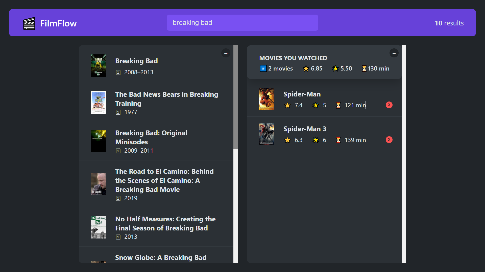

# FilmFlow

### A React Application for Film Search and Watched Movies Management

---

## Table of Contents
- [Overview](#overview)
- [Features](#features)
- [Technologies](#technologies)
- [Deployment](#deployment)
- [Author](#author)

---

## Overview
FilmFlow is an engaging React application that allows users to search for films using the OMDB API. The app provides a responsive design and leverages advanced React features, such as custom hooks and local storage, to enhance user experience and performance.

## 

---

## Features

- **Film Search**: Fetch and display movies in real-time using the OMDB API.
- **Movie Details**: Fetch detailed information about a selected movie, with options to rate and add it to the watched movies list.
- **Watched Movies Management**: Add movies to a watched list, with options to keep or remove them. Watched movies are stored in local storage.
- **Custom Hooks**: Includes `useMovies` for handling movie fetching and `useKey` for performing actions when specific keys are pressed.
- **AbortController**: Prevents fetch race conditions when data is fetched on input changes.
- **Local Storage**: Utilizes `useLocalStorage` to set and get items from local storage.
- **Responsive Design**: Optimized for various screen sizes using CSS.

---

## Technologies

- **React** (with Hooks: `useState`, `useEffect`, `useRef`)
- **Custom Hooks**: `useMovies`, `useLocalStorage`, and `useKey`
- **Vite** for fast builds and development
- **OMDB API** for movie data
- **CSS** for design and responsive styling
- **AbortController** for fetch control

---

## Deployment

# [FilmFlow Application](https://salaheddineaz47.github.io/FilmFlow/)

---

## Author

- Salah Eddine Ait Zenni
- GitHub: [salaheddineaz47](https://github.com/salaheddineaz47)

---

Feel free to reach out if you have any questions or suggestions!
